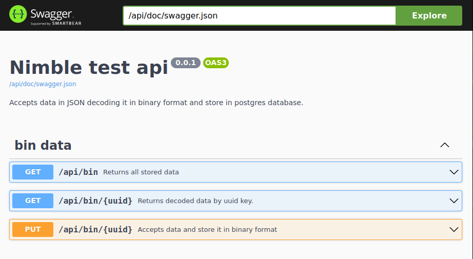

### RESTful api
Simple api performed by using `flask-restful` framework.

#### About
Postgres is used as the database. Data stored in `key-value` format where `key` must be `uuid`,
`value` will be stored in binary format.

Only `GET` and `PUT` methods are allowed.
* `PUT` method accepts `JSON` with value which must be encoded. 
* `GET` method returns `JSON` with decoded value(s)

### Visit `/api/doc` to see how to operate with this api. 

## Steps how to start project

1. Python 3.10
2. Install poetry
3. Run `poetry install` in `project_name_directory`
4. In `db_config` create `.env` file where you need to you need to specify following:
   * DB_USER=`username`
   * DB_PASSWORD=`passowrd`
   * DB_HOST=`db_address`
   * DB_PORT=`db_port`
   * DB_NAME=`db_name`
5. And finally run `app.py` and visit `/api/doc` to see further information
